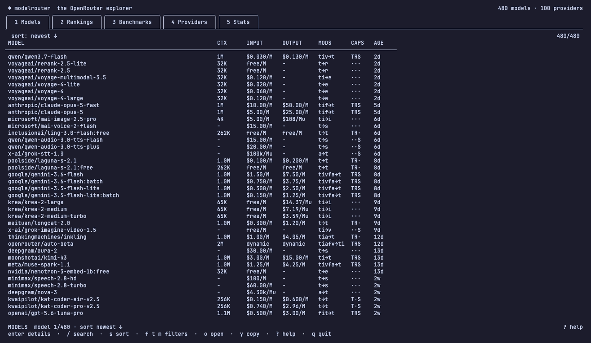
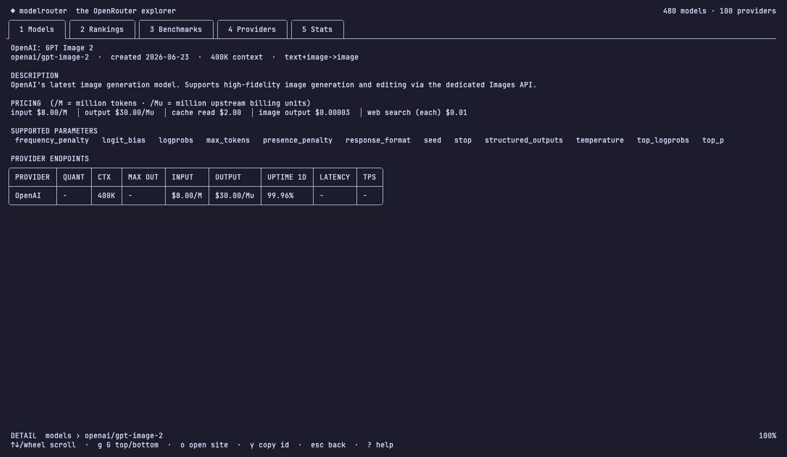
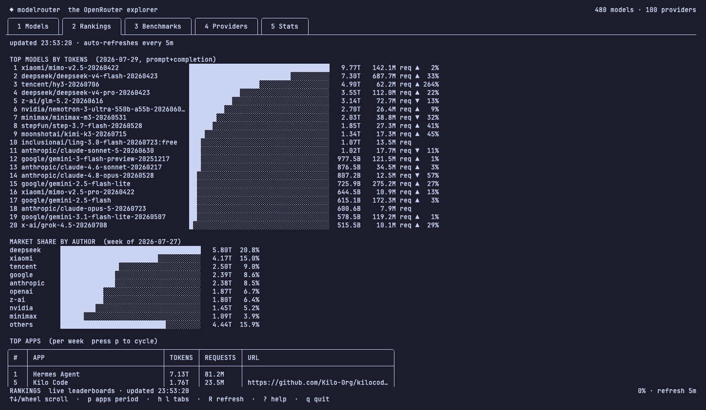
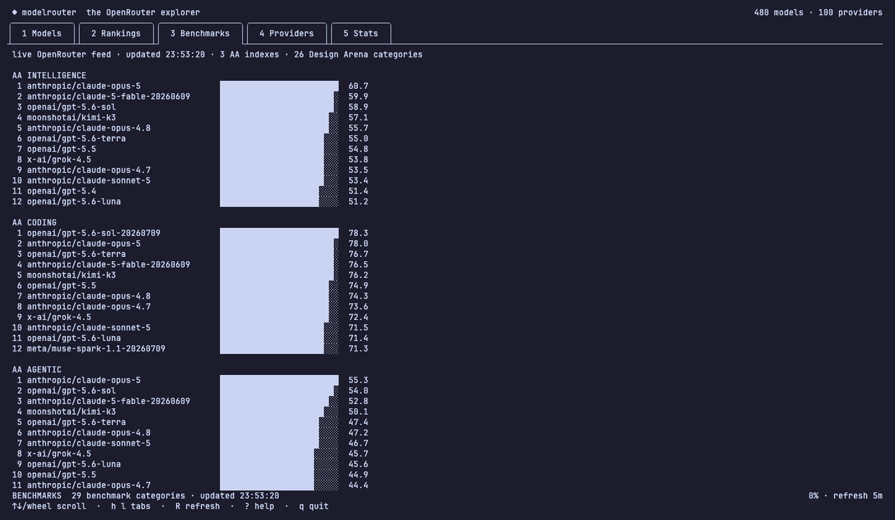
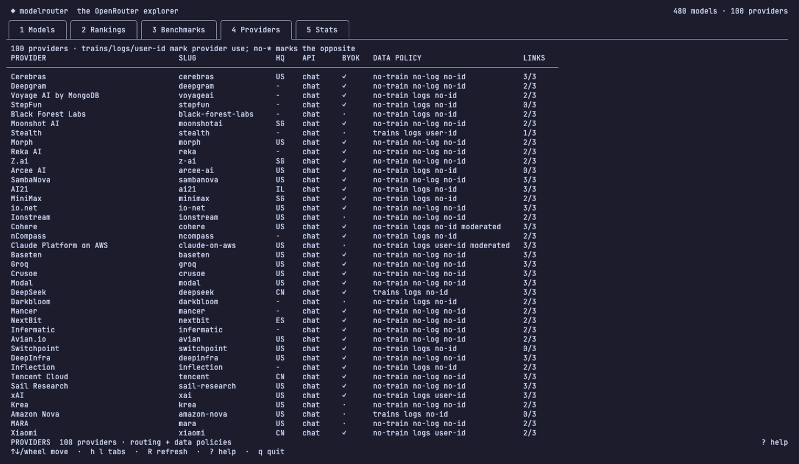
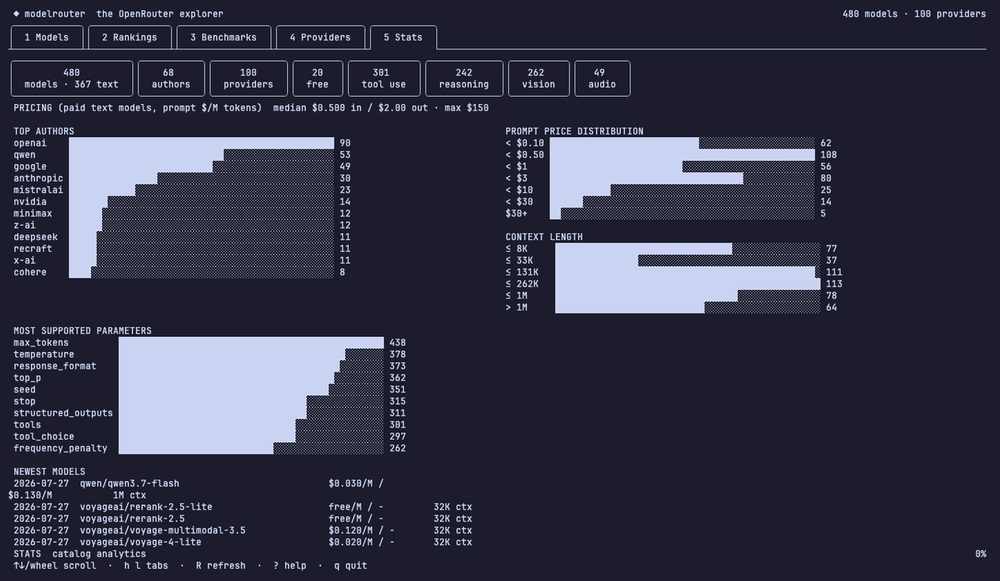
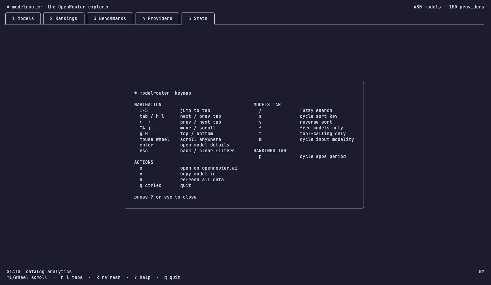

<div align="center">

# ◆ modelrouter

**A beautiful terminal UI for the entire OpenRouter catalog.**

Every model, every price, every provider endpoint — plus the live rankings,
market share, and AI benchmarks from openrouter.ai — without leaving your shell.

[](https://go.dev)
[](https://charm.sh)
[](https://github.com/charmbracelet/bubbletea)
[](LICENSE)


</div>

---

## Highlights

- **The complete model catalog** — text, image, audio, speech, transcription,
  video, embedding, and reranking models with modality-aware pricing
- **Live rankings** — token-usage leaderboards, author market share, top apps, and
  p50 latency/throughput, auto-refreshed every 5 minutes
- **AI benchmarks** — every Artificial Analysis index and Design Arena category
  currently published by OpenRouter, discovered dynamically and embedded into
  each model's detail view
- **Provider intelligence** — the complete provider directory with routing
  capabilities, BYOK, moderation, data-retention/training policy, and public
  legal/status links
- **Per-provider endpoints** — quantization, uptime, latency, and throughput for
  every provider serving a model
- **Fully scriptable** — every view is also a subcommand with `--json` output
- **Fast** — responses cached locally; works offline from cache

## Install

```sh
go install github.com/desenyon/modelrouter@latest
```

Or build from source:

```sh
git clone https://github.com/desenyon/modelrouter.git
cd modelrouter && go build -o modelrouter .
./modelrouter
```

## The TUI

Run `modelrouter` with no arguments. Five tabs, fully keyboard- and mouse-driven.

### ▸ Models

Browse, fuzzy-search (`/`), sort (`s`), and filter (`f` free · `t` tools · `m` modality)
the entire catalog. `enter` opens details, `o` opens the model on openrouter.ai,
`y` copies its id.



### ▸ Model details

Pricing (including cache and web-search rates), benchmark scores, supported
parameters, and the full per-provider endpoint table with uptime.



### ▸ Rankings

The live leaderboards from openrouter.ai/rankings: top models by token usage with
day-over-day change, author market share, top apps (`p` cycles day/week/month), and
performance leaders. Fetched fresh on open, re-fetched every 5 minutes.



### ▸ Benchmarks

Every Artificial Analysis leaderboard and Design Arena category in OpenRouter's
current feed, plus elo, win rates, and estimated cost per request. New upstream
categories appear automatically.



### ▸ Providers

The complete OpenRouter provider directory with chat/API capabilities, BYOK,
training and prompt-retention policy signals, user-ID requirements, regions,
and public legal/status links.



### ▸ Stats

Catalog-wide analytics: author counts, price and context-length distributions,
parameter popularity, and the newest models.



### ▸ Help

Press `?` anywhere for the full keymap.



## Scriptable CLI

Every view doubles as a plain command — pipe-friendly, with `--json` everywhere.

```sh
modelrouter models                          # pretty catalog table
modelrouter models --search gemini --free   # fuzzy + filters
modelrouter models --sort prompt --desc --limit 20
modelrouter models --tools --input image    # tool-calling vision models
modelrouter model claude-fable-5            # detail + endpoints + benchmarks
modelrouter rankings                        # top models by token usage
modelrouter rankings share                  # author market share
modelrouter rankings apps --period month    # top apps
modelrouter rankings perf                   # latency/throughput leaders
modelrouter benchmarks                      # AA scores + Design Arena
modelrouter providers                       # provider directory
modelrouter stats                           # catalog analytics
modelrouter export --endpoints --out all.json   # dump everything
```

Add `--json` to any of them. `--refresh` strictly bypasses the cache and returns
an error if live data cannot be fetched; ordinary reads may use a stale snapshot
during an outage.

## Keymap

| Key | Action |
|-----|--------|
| `1`–`5` · `tab` · `h`/`l` · `←`/`→` | switch tabs |
| `↑`/`↓` · `j`/`k` · mouse wheel | move / scroll |
| `g` / `G` | jump to top / bottom |
| `enter` | open model details |
| `/` | fuzzy search |
| `s` / `v` | cycle sort / reverse |
| `f` / `t` / `m` | filter free / tools / modality |
| `o` | open model on openrouter.ai |
| `y` | copy model id |
| `p` | cycle apps period (rankings) |
| `R` | refresh all data |
| `?` | help overlay |
| `q` / `ctrl+c` | quit |

## Data sources

**Official OpenRouter API** (no key required):

| Endpoint | Data |
|----------|------|
| `/api/v1/models?output_modalities=all` | complete multimodal model catalog |
| `/api/v1/models/{id}/endpoints` | per-provider endpoints, uptime, latency |
| `/api/v1/providers` | provider directory |

**Unofficial frontend API** (what openrouter.ai/rankings itself calls):

| Endpoint | Data |
|----------|------|
| `/api/frontend/v1/rankings/models` | daily token usage per model |
| `/api/frontend/v1/rankings/apps` | top apps by day/week/month |
| `/api/frontend/v1/rankings/market-share` | weekly author token share |
| `/api/frontend/v1/rankings/performance` | p50 latency/throughput |
| `/api/frontend/v1/rankings/benchmarks` | Artificial Analysis + Design Arena + request costs |
| `/api/frontend/v1/providers` | routing capabilities and public provider policy metadata |

The frontend endpoints are undocumented and may change; responses are
shape-validated and the official provider feed remains the fallback. Live
surfaces refresh every 5 minutes and are cached under your OS cache directory
(`modelrouter clear-cache` wipes it).

## Built with

[Bubble Tea](https://github.com/charmbracelet/bubbletea) ·
[Bubbles](https://github.com/charmbracelet/bubbles) ·
[Lip Gloss](https://github.com/charmbracelet/lipgloss) ·
[Cobra](https://github.com/spf13/cobra) ·
demo recorded with [VHS](https://github.com/charmbracelet/vhs)

## License

[MIT](LICENSE)
