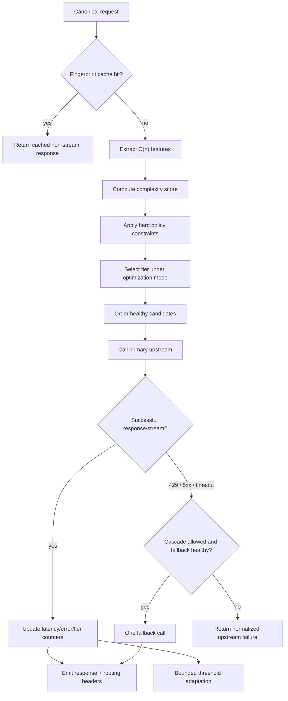
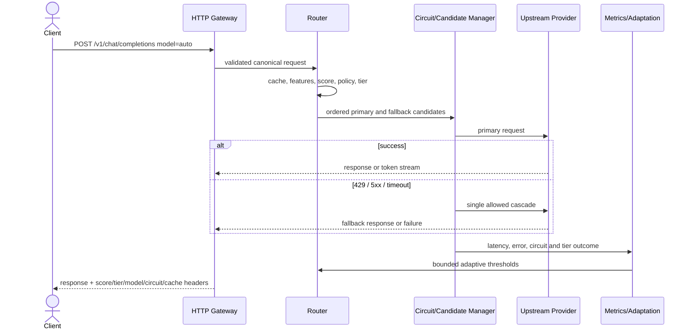

# ◆ modelrouter

**The complex-yet-efficient routing gateway for multi-model apps.**

Point any OpenAI-compatible client at modelrouter with `model: "auto"`.
Every request runs a full routing plane — **Luna** handles what it can,
**Terra** covers the middle, and **Sol** fires only when the task needs
frontier intelligence.

Stop paying Sol prices for Luna jobs.

[](https://go.dev)
[](https://platform.openai.com/docs/api-reference)
[](LICENSE)

```
client → cache → features → score → policy → tier → candidate/circuit
                                                      ↓
                                              proxy → cascade → adapt
```

---

## Why

Most traffic does not need your most expensive model. Renames, summaries,
boilerplate, short answers — **Luna**. Reserve **Sol** for architecture,
hard debugging, long-horizon agents, and work where frontier quality
actually moves the outcome.

modelrouter is the separate routing plane for your app: sophisticated
decisions on a pure-Go O(n) hot path — no secondary LLM, no embeddings.

## Pipeline

| Stage | What it does |
|-------|----------------|
| **Fingerprint cache** | LRU replay of identical non-stream chats |
| **Features** | Single-pass vector: tokens, tools, code, markers, structure |
| **Score** | Weighted multi-axis complexity in `[0,1]` |
| **Policy** | Force Luna on easy work; suppress Sol below threshold; min Terra for tools |
| **Tier** | Luna-first pick under cost / balance / intelligence |
| **Candidate + circuit** | Primary + fallbacks with EWMA latency & open/half-open breakers |
| **Cascade** | One escalate on 429 / 5xx / timeout (never Sol for Luna-forced easy) |
| **Adapt** | Bounded threshold nudge from Sol-share EWMA (±0.05) |

## Quick start

```sh
go install github.com/desenyon/modelrouter@latest

export OPENROUTER_API_KEY=sk-or-...
modelrouter serve
```

```bash
curl http://127.0.0.1:8787/v1/chat/completions \
  -H "Content-Type: application/json" \
  -d '{
    "model": "auto",
    "optimize_for": "balance",
    "messages": [{"role":"user","content":"Rename this variable for clarity."}]
  }'
```

Headers tell you what happened:

```
X-Modelrouter-Tier: luna
X-Modelrouter-Model: openai/gpt-5.6-luna
X-Modelrouter-Mode: balance
X-Modelrouter-Score: 0.040
X-Modelrouter-Circuit: closed
X-Modelrouter-Cache: MISS
```

## CLI

```sh
modelrouter serve                         # start gateway (default)
modelrouter serve --mode cost
modelrouter serve -c config.yaml

modelrouter route "fix this race condition in the scheduler"
modelrouter route --json "write a commit message"
modelrouter models
modelrouter version
```

`route` prints the full decision trace: score, policy hits, candidates,
circuit state, effective thresholds, and feature vector.

## Configuration

See [`config.example.yaml`](config.example.yaml).

| Variable | Purpose |
|----------|---------|
| `MODELROUTER_LISTEN` | Bind address (default `:8787`) |
| `MODELROUTER_API_KEY` | Optional key protecting the gateway |
| `MODELROUTER_UPSTREAM_BASE_URL` | OpenAI-compatible base URL |
| `MODELROUTER_UPSTREAM_API_KEY` | Upstream key (`OPENROUTER_API_KEY` / `OPENAI_API_KEY`) |
| `MODELROUTER_MODE` | `cost` \| `balance` \| `intelligence` |
| `MODELROUTER_LUNA` / `_TERRA` / `_SOL` | Primary upstream ids per tier |

## HTTP API

| Method | Path | Description |
|--------|------|-------------|
| `GET` | `/healthz` | Liveness, thresholds, open circuits |
| `GET` | `/metrics` | Tier mix, cache, cascades, circuits, adaptive thresholds |
| `GET` | `/v1/models` | Virtual model catalog |
| `POST` | `/v1/chat/completions` | Routed chat (streaming + cascade) |
| `POST` | `/v1/route` | Full classification / policy / candidate trace |

## Efficiency budget

- Classify + policy + candidate: typically **&lt;1ms**
- No extra network on the decision path
- Cache / circuit / adaptive: in-memory atomics + LRU
- One upstream call common case; two only on cascade

## Install from source

```sh
git clone https://github.com/desenyon/modelrouter.git
cd modelrouter
go build -o modelrouter .
./modelrouter serve
```

## License

[MIT](LICENSE)

<!-- architecture-atlas-v5:start -->
## Architecture Atlas v5

These editable Mermaid diagrams mirror the [Notion architecture dossier](https://app.notion.com/p/3b467342e8c181e7874eec74a2531035?pvs=204).

### 1. Routing anatomy

```mermaid
flowchart LR
  CLIENT["OpenAI-compatible client"] --> HTTP["HTTP validation, auth, streaming contract"]
  HTTP --> CACHE["Fingerprint LRU<br>identical non-stream replay"]
  CACHE --> FEATURE["Single-pass feature vector<br>tokens, tools, code, markers, structure"]
  FEATURE --> SCORE["Weighted multi-axis complexity score"]
  SCORE --> POLICY["Cost / balance / intelligence policy<br>easy-force and tool minimum rules"]
  POLICY --> TIER["Luna / Terra / Sol tier selector"]
  TIER --> CAND["Candidate registry"]
  CAND --> CIRCUIT["Per-candidate EWMA + circuit breaker"]
  CIRCUIT --> PROXY["Upstream proxy + stream copier"]
  PROXY --> CASCADE["At most one bounded escalation"]
  CASCADE --> ADAPT["Sol-share EWMA threshold nudge ±0.05"]
  ADAPT --> OBS["Decision headers, trace, health, metrics"]
```



### 2. Decision wiring



### 3. Runtime narrative



### 4. Reliability model

```mermaid
stateDiagram-v2
  [*] --> RECEIVED
  RECEIVED --> CACHE_HIT: identical safe replay
  RECEIVED --> CLASSIFIED: cache miss
  CLASSIFIED --> POLICY_APPLIED --> CANDIDATES_READY --> PRIMARY_IN_FLIGHT
  PRIMARY_IN_FLIGHT --> STREAMING: success
  PRIMARY_IN_FLIGHT --> CASCADE_IN_FLIGHT: allowed retryable failure
  CASCADE_IN_FLIGHT --> STREAMING: success
  PRIMARY_IN_FLIGHT --> FAILED: terminal failure
  CASCADE_IN_FLIGHT --> FAILED: terminal failure
  STREAMING --> COMPLETE
```

<!-- architecture-atlas-v5:end -->
